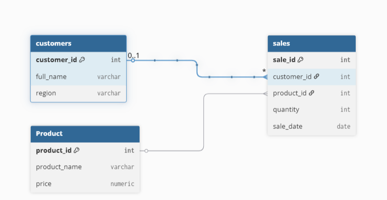

# plsql_window_functions_28306_teddy

## Business Problem

### Business Context

Camellia Restaurant is a mid-sized restaurant operating in the food service industry. The management wants to better understand customer behavior, product performance, and sales trends to support data-driven decision-making.

### Data Challenge

Camellia Restaurant collects transactional sales data daily, but the data has not been fully analyzed to extract meaningful insights. Management struggles to identify top-performing menu items, customer purchasing patterns, and sales trends over time.

### Expected Outcome

The analysis aims to provide actionable insights that help management improve menu optimization, customer targeting, and revenue growth.

---

## Success Criteria

The project achieves the following five measurable goals using SQL window functions:

1. Identify the **top 5 menu items per month** using `RANK()`
2. Calculate **running monthly sales totals** using `SUM() OVER()`
3. Measure **month-over-month sales growth** using `LAG()`
4. Segment customers into **quartiles based on spending** using `NTILE(4)`
5. Compute **three-month moving average sales trends** using `AVG() OVER()`

---

## Database Schema Design

```sql
CREATE TABLE customers (
    customer_id SERIAL PRIMARY KEY,
    full_name VARCHAR(100),
    region VARCHAR(50)
);
CREATE TABLE products (
    product_id SERIAL PRIMARY KEY,
    product_name VARCHAR(100),
    price NUMERIC(10,2)
);

CREATE TABLE sales (
    sale_id SERIAL PRIMARY KEY,
    customer_id INT REFERENCES customers(customer_id),
    product_id INT REFERENCES products(product_id),
    quantity INT,
    sale_date DATE
);

```

### ER Diagram



## Part A: SQL JOINs Implementation

### JOIN Types Implemented

1. **INNER JOIN**
```sql
SELECT c.full_name, p.product_name, s.quantity
FROM sales s
INNER JOIN customers c ON s.customer_id = c.customer_id
INNER JOIN products p ON s.product_id = p.product_id;

```

```
2. **LEFT JOIN** – Identify customers who have never made a transaction

//Left JOIN
SELECT c.full_name
FROM customers c
LEFT JOIN sales s ON c.customer_id = s.customer_id
WHERE s.sale_id IS NULL;


```

```

3. **RIGHT JOIN / FULL JOIN** – Detect products with no sales activity

// Right join
SELECT p.product_name
FROM sales s
RIGHT JOIN products p ON s.product_id = p.product_id
WHERE s.sale_id IS NULL;
```

```

4. **FULL OUTER JOIN** – Compare customers and products including unmatched records

//FULL OUTER JOIN
SELECT c.full_name, p.product_name
FROM customers c
FULL OUTER JOIN sales s ON c.customer_id = s.customer_id
FULL OUTER JOIN products p ON s.product_id = p.product_id;
```


```


5. **SELF JOIN** – Compare customers within the same region

//self join
SELECT a.full_name, b.full_name, a.region
FROM customers a
JOIN customers b
ON a.region = b.region
AND a.customer_id <> b.customer_id;
Each JOIN includes:

```


```

//Part B: SQL Window Functions Implementation

#### 1. Ranking Functions
SELECT product_id,
SUM(quantity) AS total_sales,
RANK() OVER(ORDER BY SUM(quantity) DESC)
FROM sales
GROUP BY product_id;
```

```

  Use case: Top-performing products and customers by revenue

#### 2. Aggregate Window Functions

//running total
SELECT sale_date,
SUM(quantity) OVER(ORDER BY sale_date ROWS BETWEEN UNBOUNDED PRECEDING AND CURRENT ROW)
FROM sales;
```

```


#### 3.customer Segmentation

SELECT customer_id,
NTILE(4) OVER(ORDER BY SUM(quantity) DESC)
FROM sales
GROUP BY customer_id;
```

```


//Results Analysis

### Descriptive Analysis

Sales are concentrated in Kigali branch and main course items generate the highest revenue.Sales were higher during weekends, and grilled chicken and rice meals were the top-selling products.


### Diagnostic Analysis

Higher revenue in Kigali may be due to population density and higher purchasing power.
Higher sales occurred due to promotional discounts and increased customer traffic during evenings.

### Prescriptive Analysis

The restaurant should promote low-performing items and implement loyalty programs for high-value customers.Camellia Restaurant should introduce loyalty programs and focus marketing on top-performing meals.


## Key Insights

- A small number of menu items generate a large share of total revenue
- High-value customers can be effectively segmented using spending quartiles
- Sales trends reveal opportunities for targeted promotions

## References

1. Oracle Documentation – SQL Analytical (Window) Functions  
   https://docs.oracle.com/en/database/oracle/oracle-database/19/sqlrf/Analytic-Functions.html

2. PostgreSQL Documentation – Window Functions  
   https://www.postgresql.org/docs/current/tutorial-window.html

3. MySQL Documentation – Window Functions  
   https://dev.mysql.com/doc/refman/8.0/en/window-functions.html

4. W3Schools – SQL JOINs  
   https://www.w3schools.com/sql/sql_join.asp

5. W3Schools – SQL Window Functions  
   https://www.w3schools.com/sql/sql_window_functions.asp

6. GeeksforGeeks – SQL Window Functions  
   https://www.geeksforgeeks.org/window-functions-in-sql/

7  - Camellia Restaurant Official Website: https://cafecamellia.rw/


